---
---
---
---
---
# Science and the world
---
## Some initial thoughts

One of the greatest achievements of man kind is the ability control it's environment.

Think of all the beings in the planet several thousand years ago, in the begging of mankind as a species: at some point most of them were stronger, faster, or more numerous human kind. Yet we were the ones who thieved in this environments.

Tho achieve this we din't need to be any better at these qualities, we only had to outsmart our opponents. This came as direct consequence of our ability learn with the environment.

Taking a pure utilitarian point of view of an engineer, it can be clearly shown in each process our species managed to master by observation or **needs** and **resources**.

***Basic need for food***:
	1. (*Problem*)     Difficulty to survive when we could't even cut our food.
	2. (*Observation*) Sharp rock can cut flesh and wood.
	3. (*Observation*) When rocks fall from high enough they brake.
	4. (*Hypothesis*)  It's possible to break stones to make tools.

***Basic need for heat***:
	1. (*Problem*)     Climate can be cold and humid.
	2. (*Observation*) Lightning starts fire.
	3. (*Observation*) Some stones spark when falling on each other.
	4. (*Hypothesis*)  Stones can start fires.

***Basic need for shelter***:
	1. (*Problem*)     The night can be cold.
	2. (*Observation*) Broken stones can cut wood.
	3. (*Observation*) Wood is strong and light.
	4. (*Hypothesis*)  Let's make a home.

**...**

---
## Whats and hows:

- ***5W2H and human nature:***
	- If you want to truly understand
	- ==What?== ==Why?== Who? When? Where? ==How?== How much?

- ***How can we truly understand something?***
	- ==What== is the nature of something?
		- ==Why== it is this way?
	- ==How== does this thing behave?
		- ==Why== does it behave like this?

- ***How can we predict (model) the future of something?***
	- **Requisites:**
		1. Rough description of ==what it is==
		2. Good description of ==how it interacts with the environment==.
		3. Good description of ==how it changes== (interact with itself)
	- **Procedure:**
		1. Knowledge of the ==current state==.
		2. Knowledge of how ==change== occur.
		3. Inference (simulation) of the ==future state==.
			*- There are several ways to get this answers.*

---
---
---
# Preface to the following parts: Why all the following explanations?
- (***What?***)  Understand the nature of the electron and the atom.
- (***Why?***)   Understand their behavior.
- (***How?***)   Try to grasp future behavior.

---
---
---
# What are molecules?
---
## Atoms
>	How can we understand the fundamental structures of matter?

***The division path:***
- How can we "see" the atom?
- Material -> Particle -> Grain -> Molecule -> Atom -> Quark -> (strings etc?)
### Proving atoms exist and how they behave

***Metals: the first standard for studying solids and the structure of materials.***
	
	([Micrograph of a polycrystalline metal](Data/https://en.wikipedia.org/wiki/Grain_boundary#/media/File:CrystalGrain.jpg))

***The rigid sphere model for metals***
	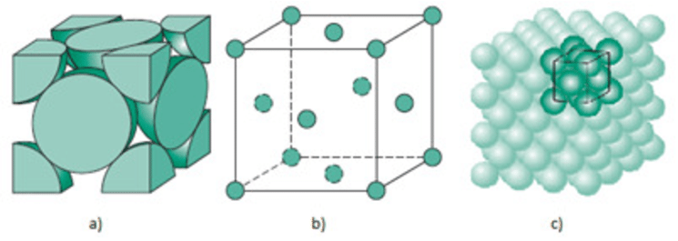
	([Face-centered cubic (FCC) unit cell](Data/https://www.researchgate.net/figure/The-FCC-crystal-structure-a-hard-sphere-unit-cell-representation-b-a-reduced_fig5_322291448))

***Deeper look: Seeing inside the grains***
	Transmission microscopes and the diffraction phenomena:
	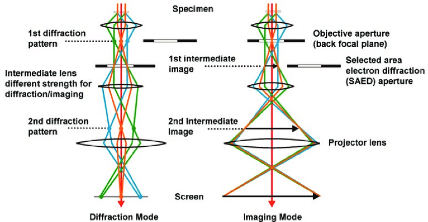
	([TEM - SAED - Lenses](Data/https://www.researchgate.net/figure/Schematic-ray-diagrams-in-a-TEM-column-showing-the-operation-of-the-post-specimen-lenses_fig4_244749061))
	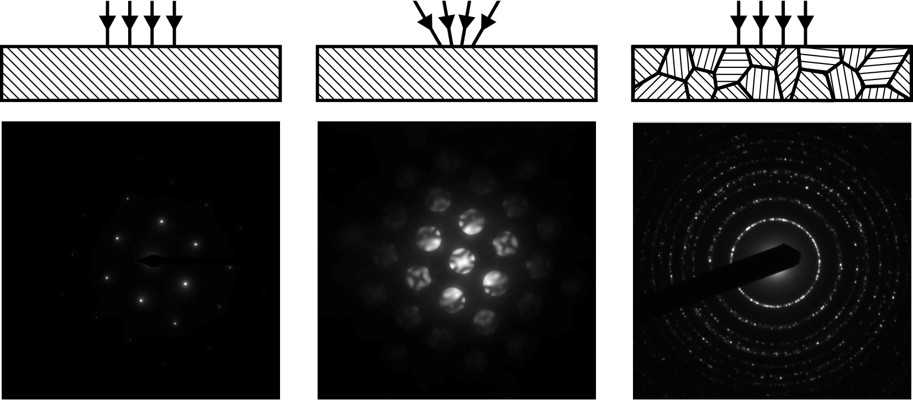
	([Cristal Diffraction](Data/https://en.wikipedia.org/wiki/File:Difrakce.png))
	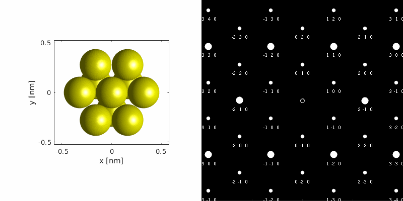
	([Diffraction simulation for Mg](Data/https://en.wikipedia.org/wiki/Selected_area_diffraction#/media/File:Crystal_orientation_and_diffraction.gif))

---
## Wave-particle behavior

***Expected behavior for particles:***
	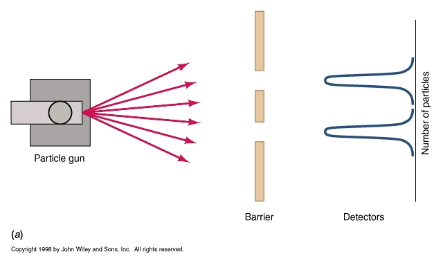
	([Quantum Mechanics Important Points](Data/https://www.geo.arizona.edu/xtal/nats101/s02-17.html))

***Expected behavior for waves (diffraction):***
	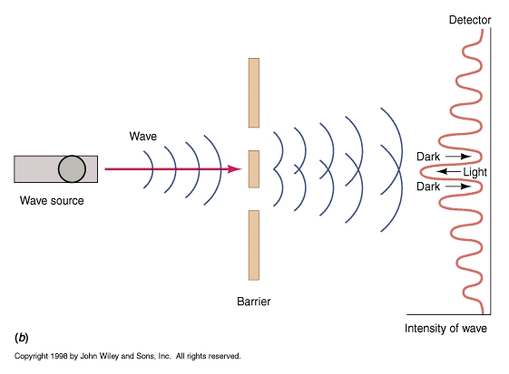
	([Quantum Mechanics Important Points](Data/https://www.geo.arizona.edu/xtal/nats101/s02-17.html))
	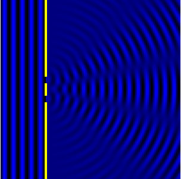
	([Double-slit experiment](Data/https://en.wikipedia.org/wiki/File:Doubleslit.gif))

***Actual behavior of the electron (particle-wave duality):***
	
	([Wikipedia: Wave–particle duality](Data/https://en.wikipedia.org/wiki/Wave%E2%80%93particle_duality))

---
---
---
# Iterations between atoms
---
### How to describe movement?
- Forces and acceleration
- Simplest form: Newton's second law
		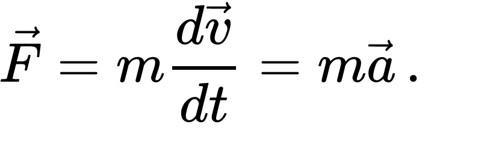
		([Wikipedia: Newton's laws of motion](Data/https://en.wikipedia.org/wiki/Newton%27s_laws_of_motion))

	> Forces mediate ==interactions==, the result of interactions regarding ==movement== is ==acceleration==.

---
## Forces
- ***Gravity:***
	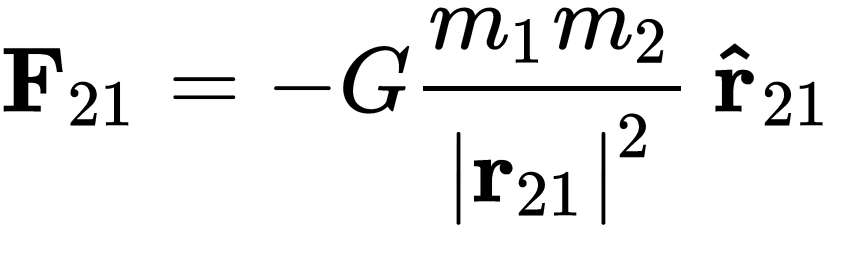
	([Wikipedia: Newton's law of universal gravitation](Data/https://en.wikipedia.org/wiki/Newton's_law_of_universal_gravitation))
	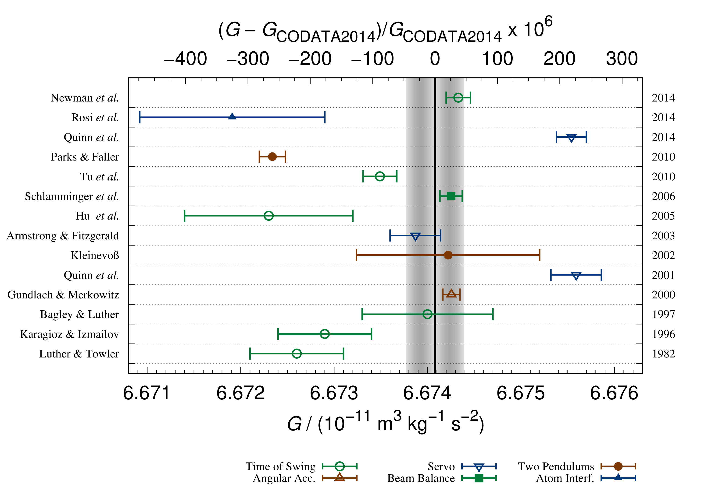
	([Wikipedia: G constant](Data/https://en.wikipedia.org/wiki/Newton's_law_of_universal_gravitation#/media/File:Gravity_Big_G_Measurements_NIST.png))

- ***Electric force (Coulomb's Law):***
	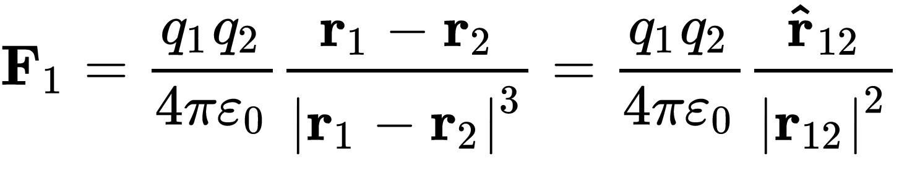
	([Wikipedia: Coulomb's law](Data/https://en.wikipedia.org/wiki/Coulomb%27s_law))
	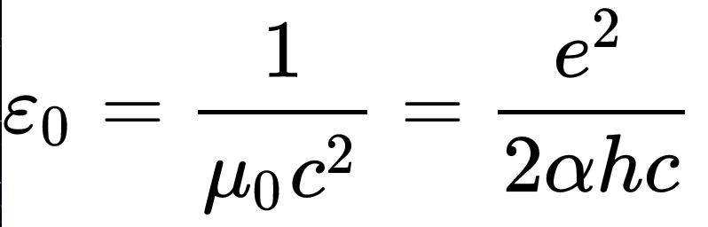
	([Vacuum permittivity](Data/https://en.wikipedia.org/wiki/Vacuum_permittivity))
- ***Weak force:***
	- [Wikipedia: Weak interaction](Data/https://en.wikipedia.org/wiki/Weak_interaction)
- ***Strong force:***
	- [Wikipedia: Strong interaction](Data/https://en.wikipedia.org/wiki/Strong_interaction)

---
## Atomic bonds
There are three types of atomic bonds, they are:

***Ionic bond:***
	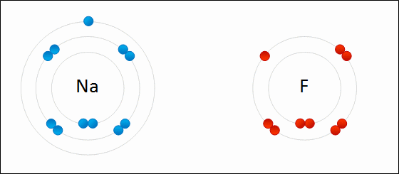
	([Wikipedia: Ionic bonding](Data/https://en.wikipedia.org/wiki/Ionic_bonding))
 
***Covalent bond:***
	 ([Wikipedia: Chemical bond](Data/https://en.wikipedia.org/wiki/Chemical_bond))
	 ([Wikipedia: Covalent bond](Data/https://en.wikipedia.org/wiki/Covalent_bond))
	.svg) ([Wikipedia: Molecular orbital](Data/https://en.wikipedia.org/wiki/Covalent_bond))

***Metallic bond:***
	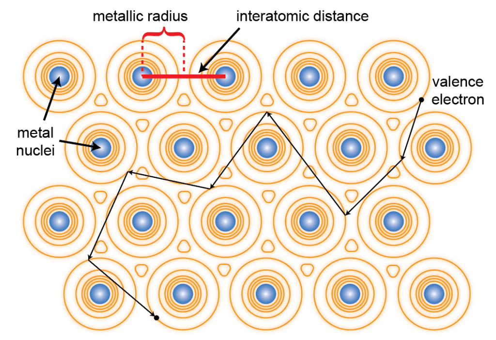
	([ChemTalk: Metallic Bonding](Data/https://chemistrytalk.org/metallic-bonding/))

---
## Molecular behavior
### Stability concept:
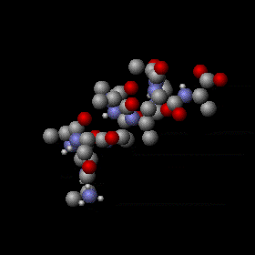
([Wikipedia: Temperature](Data/https://en.wikipedia.org/wiki/Temperature))

([Wikipedia: Metastability](Data/https://en.wikipedia.org/wiki/Metastability))

***Minimization of energy: bond length and molecule states***
	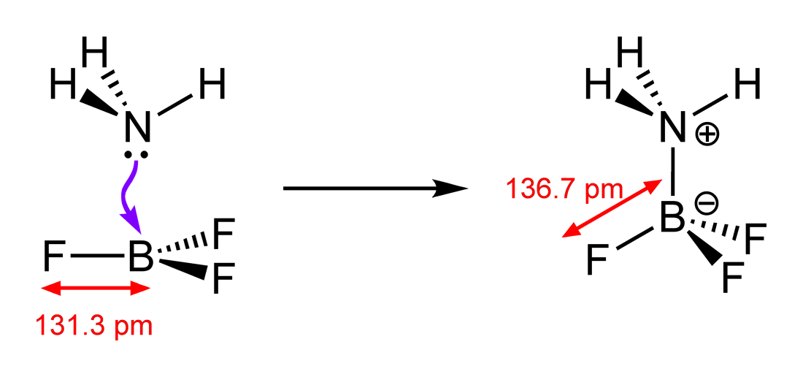
	([Wikipedia: Coordinate covalent bond (dipolar bond)](Data/https://en.wikipedia.org/wiki/Chemical_bond))

***Polarity:***
	
	([**Water molecule polarity** | Wikipedia: Chemical polarity](Data/https://en.wikipedia.org/wiki/Chemical_polarity))
	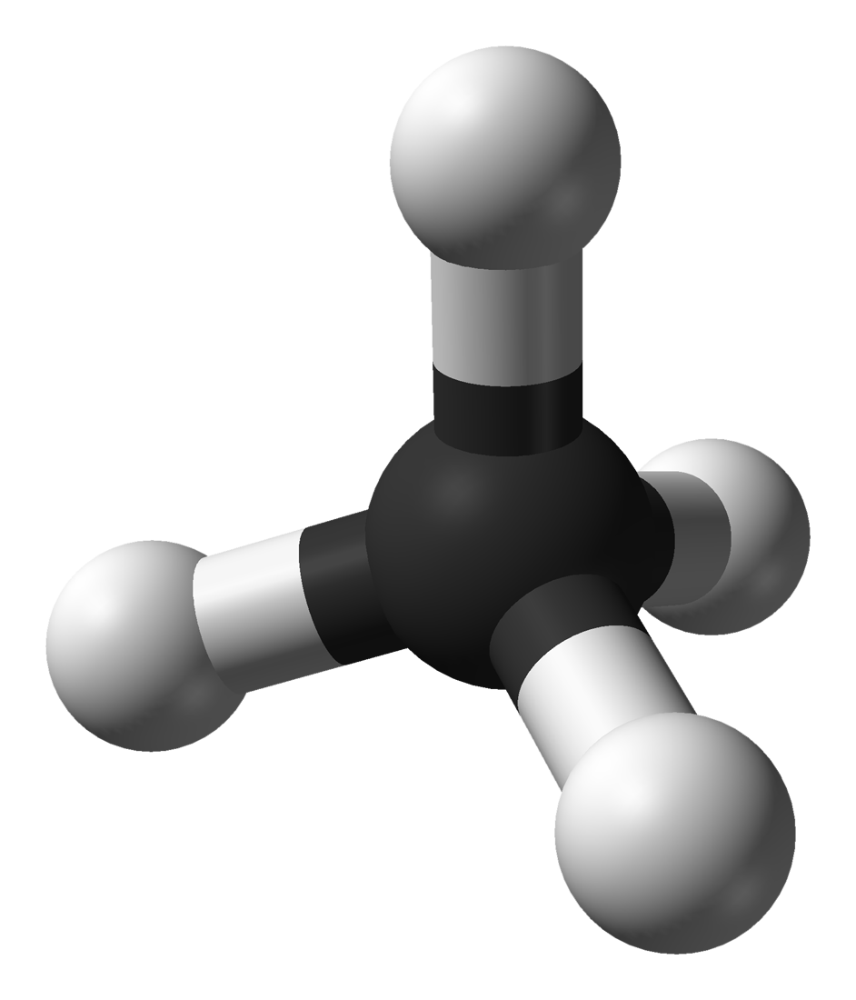
	([**Methane molecule polarity** | Wikipedia: Chemical polarity](Data/https://en.wikipedia.org/wiki/Chemical_polarity))

---
---
---
# Interactions between isolated molecules

***Dipole-dipole:***
	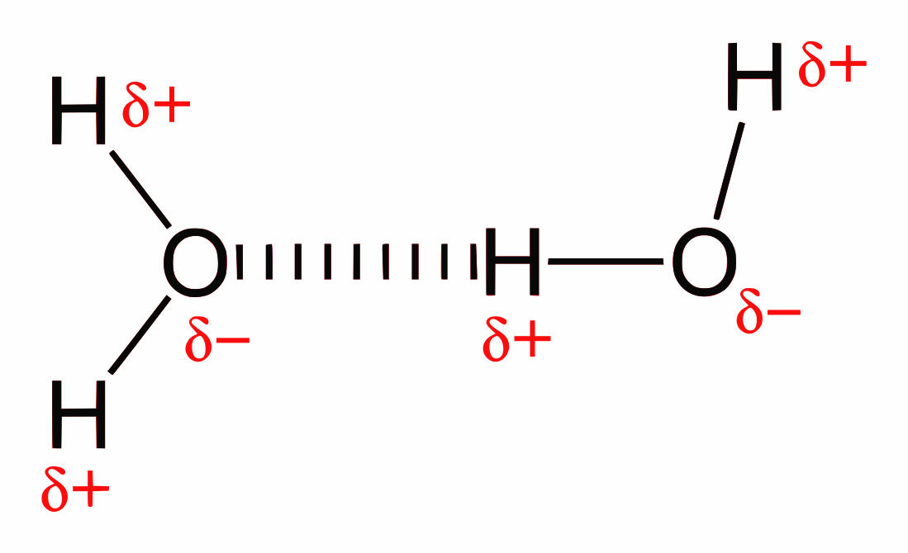
	([Wikipedia: Chemical bond](Data/https://en.wikipedia.org/wiki/Chemical_bond))

***Van-der-Waals forces:***
- Keesom force (permanent dipole – permanent dipole)
- Debye force (permanent dipoles–induced dipoles)
- London dispersion force (fluctuating dipole–induced dipole interaction)

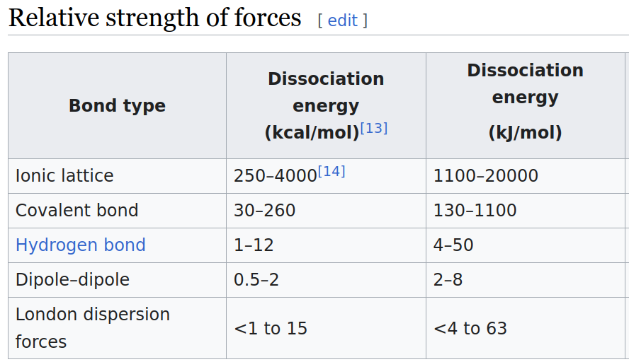

---
---
---
# Modeling
---
## Starting with the questions:

- **Requisites:** (==DONE==)
	1. Rough description of what it is
	2. Good description of how it interacts with the environment.
	3. Good description of how it changes (interact with itself)
- **Procedure:**
	1. Knowledge of the ==current state==.
	2. Knowledge of how ==change== occur.
	3. Inference (simulation) of the ==future state==.
		*- There are several ways to get this answers.*

### How can we represent molecules in a 3D space?
- Current state:
	- ==Position==: 3D vector (m) (Vec<Vec<f32>>)
	- ==Orientation==: 3D vector (degrees)  (Vec<Vec<f32>>)
	- ==Velocity==: 3D vector (m/s)  (Vec<Vec<f32>>)
	- ==Angular velocity==: (degrees/s)  (Vec<Vec<f32>>)
- How change occur?
	- With the environment: force fields
	- With itself:
		- Movement dynamics: newtons second law
- ==Simulation  of future state==

### What is a reasonable model for molecule simulation?
- #todo 

D = (1/C0) * 10^(-21) [C*m]

